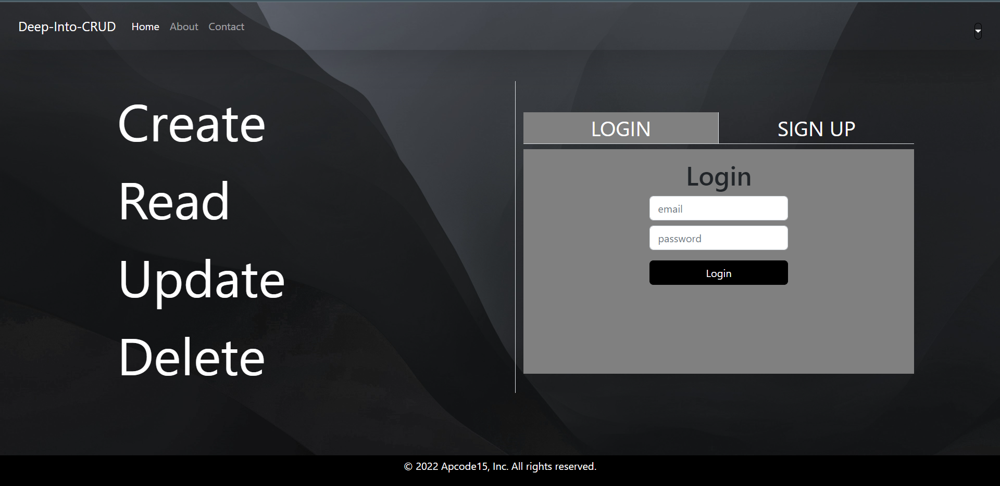
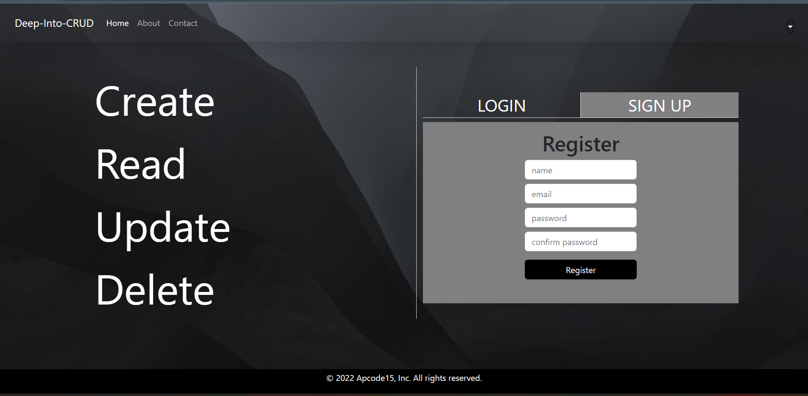
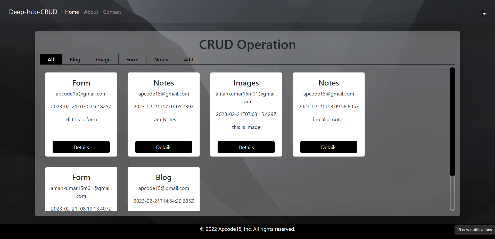
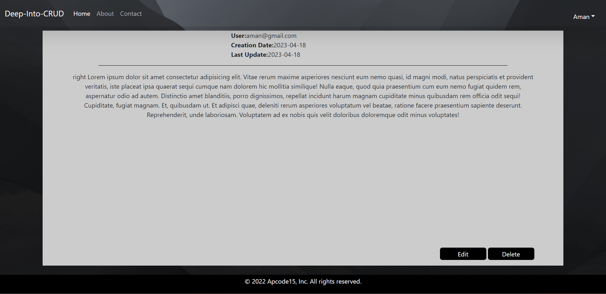
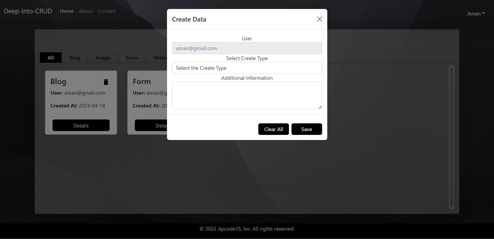

# DEEP-INTO-CRUD

- Full-stack project for Storing the files, images, Blogs, Forms and Notes with attractive UI ‘website’.
- App should be responsive with the portrait mode and placed horizontally when in landscape mode.
- Implemented CRUD(Create Read Update and Delete) operations on various collections such as users of the database.
- Rendered the stored data ‘filtered’ on the basis of type of data during selected images, blogd, etc.
- Implemented user authentication and ACID properties.
- Different levels of access for normal users.
- Techs Involved - NodeJS | ExpressJS | ReactJS | MongoDB | Redux | Postman | Git

### Detailed Design:

- Built the app using react functional components with hooks to handle state and other life cycle methods
- App component acts as the core parent component of application, it takes care of loading the initial state, data communication and also handles how the data gets propagated to various underlying components
- Kept the layout of the application simple to have any modification or enhancement in future to evolve the layout as required

### Front End Implementation:

- HTML
- CSS
- React

## Image UI
Following are the screenshot of the application:

### Home/Login Page
- This is the home page i.e first page.

### Dashboard

- This is the dashboard.

### Detail data

- Every element's detailed information.

### Create Modal

- This is create modal.

<!-- ### Register Page

- This is the register page.

### Home Page

- This is the home page.

### Admin Panel Page

- This is the Admin Panel page which is only for admins only. -->

## How to Run the Application:

Clone the repo and setup the application

- git clone https://github.com/amankumar-2001/deep-into-crud
- cd deep-into-crud
- npm install
- npm start

## Author

- [@amankumar-2001](https://www.github.com/amankumar-2001)

